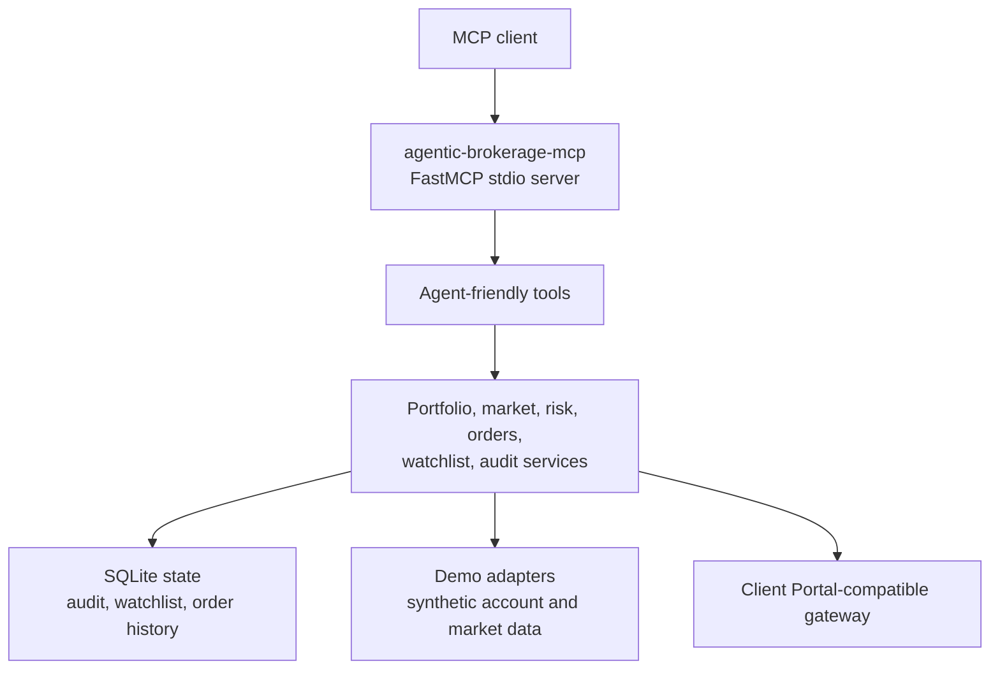

# agentic-brokerage-mcp

An opinionated MCP server for AI-assisted brokerage workflows. It translates broker API complexity into a small set of composable, agent-friendly tools with dry-run previews, audit logging, demo data, and human approval boundaries.

This project is independent and unofficial. It is not affiliated with, endorsed by, or sponsored by Interactive Brokers LLC or its affiliates. Interactive Brokers and IBKR are trademarks or service marks of their respective owners.

## What This Is

`agentic-brokerage-mcp` is a Python 3.12 MCP server for portfolio review, market context, watchlist management, risk sizing, order previews, audit inspection, and explicitly approved order submission through an Interactive Brokers Client Portal-compatible gateway.

It is designed for agent hosts such as Codex, Claude Desktop, and other MCP clients. The default install runs in demo mode with synthetic account, market, option, and order data, so you can inspect behavior without broker credentials.

## What This Is Not

This is not a 1:1 broker API wrapper, a trading bot, a recommendation engine, or a guarantee that an order is suitable for your account. It does not include a private agent daemon, backtesting workstation, personal deployment scripts, local credentials, or proprietary trading notes.

Live trading is dangerous. A model can misunderstand intent, stale market data, account state, margin, option risk, or broker responses. Live order submission is opt-in and should only be used with human review.

## Why Opinionated

Broker APIs expose a large operational surface. Agents work better with small tools whose contracts map to workflows:

- `portfolio` returns the account context an agent needs before proposing action.
- `position_size` gives advisory sizing with cash, margin, and exposure context.
- `submit_order` defaults to dry-run previews and bracket order structure.
- `audit` makes mutating actions inspectable after the fact.

The goal is to make the safe path the easy path, while still leaving room for advanced users to connect a live Client Portal gateway deliberately.

## Architecture



## Tool Surface

| Tool | Purpose | Mutates State |
|---|---|---:|
| `ibkr_session` | Check or restore gateway authentication status. In demo mode it reports a synthetic connected session. | No |
| `portfolio` | Account totals, positions, concentration warnings, currency exposure, live orders, trades, and recent order history. | No |
| `market` | Technical context plus recent broker news headlines for a symbol or option contract. | No |
| `search_symbol` | Resolve broker contracts by symbol or company name. | No |
| `option_chain` | Inspect option expirations and strikes. | No |
| `search_option_contracts` | Resolve exact option contracts. | No |
| `get_option_greeks` | Read option snapshot fields and greeks. | No |
| `position_size` | Advisory risk sizing from account value, stop distance, market data, and exposure. | No |
| `submit_order` | Dry-run preview by default; optionally submit simulated or live orders. Bracket mode is the default. | Yes |
| `manage_order` | List, cancel, or modify open orders. Cancel/modify are guarded in live mode. | Yes |
| `manage_watchlist` | Local watchlist CRUD and review timestamps. | Yes |
| `audit` | Query audit entries and recent action statistics. | No |

## Safety Model

- Demo mode is the default: `AGENTIC_BROKERAGE_MCP_BROKER_MODE=demo`.
- `submit_order` defaults to `dry_run=true`.
- Live submit, cancel, and modify require `AGENTIC_BROKERAGE_MCP_BROKER_MODE=live` and `AGENTIC_BROKERAGE_MCP_ENABLE_LIVE_TRADING=true`.
- Mutating actions are written to a local SQLite audit log.
- Bracket previews are preferred for directional trades with a known entry, stop, and target.
- The tool surface is intentionally narrow. Multi-step judgment should live in client prompts or skills, with the server enforcing clear operational boundaries.

## Setup

```bash
uv sync
cp .env.example .env
uv run pytest
```

Run the MCP server in demo mode:

```bash
AGENTIC_BROKERAGE_MCP_BROKER_MODE=demo uv run agentic-brokerage-mcp
```

## MCP Client Example

```json
{
  "mcpServers": {
    "agentic-brokerage": {
      "command": "uv",
      "args": [
        "--directory",
        "/path/to/agentic-brokerage-mcp",
        "run",
        "agentic-brokerage-mcp"
      ],
      "env": {
        "AGENTIC_BROKERAGE_MCP_BROKER_MODE": "demo"
      }
    }
  }
}
```

See `examples/mcp/codex.json` and `examples/skills/` for sanitized workflow prompts.

## Demo Mode

Demo mode uses synthetic account, position, quote, option, news, and order data. It requires no broker account and makes no network calls to a brokerage gateway. You can call `portfolio`, `market`, `position_size`, `submit_order(dry_run=true)`, and even simulated `submit_order(dry_run=false)` safely.

Demo state still writes audit, watchlist, and order history rows to SQLite so client workflows behave like a real local setup.

## Live Mode

Live mode expects an already running Interactive Brokers Client Portal-compatible gateway at `AGENTIC_BROKERAGE_MCP_IBKR_BASE_URL`. The official Client Portal Gateway and iBeam are both viable ways to provide that gateway; iBeam is optional infrastructure, not a package requirement.

Minimum live read-only configuration:

```bash
AGENTIC_BROKERAGE_MCP_BROKER_MODE=live
AGENTIC_BROKERAGE_MCP_IBKR_BASE_URL=https://localhost:5001/v1/api
AGENTIC_BROKERAGE_MCP_IBKR_ACCOUNT_ID=YOUR_ACCOUNT_ID
AGENTIC_BROKERAGE_MCP_ENABLE_LIVE_TRADING=false
```

To allow live submit/cancel/modify operations, set:

```bash
AGENTIC_BROKERAGE_MCP_ENABLE_LIVE_TRADING=true
```

Do this only when your MCP client workflow has an explicit human approval step after dry-run previews.

See [Client Portal Gateway](docs/gateway.md) for the gateway integration contract, official gateway option, and iBeam notes.

## Configuration

| Variable | Default | Description |
|---|---|---|
| `AGENTIC_BROKERAGE_MCP_BROKER_MODE` | `demo` | `demo` uses synthetic adapters. `live` connects to a Client Portal-compatible gateway. |
| `AGENTIC_BROKERAGE_MCP_BASE_CURRENCY` | `USD` | Account-level reporting currency used by local calculations. |
| `AGENTIC_BROKERAGE_MCP_DB_PATH` | `~/.agentic-brokerage-mcp/state.db` | SQLite path for audit, watchlist, and local order history. |
| `AGENTIC_BROKERAGE_MCP_IBKR_BASE_URL` | `https://localhost:5001/v1/api` | Live Client Portal-compatible gateway API URL. |
| `AGENTIC_BROKERAGE_MCP_IBKR_ACCOUNT_ID` | empty | Required for live account calls. |
| `AGENTIC_BROKERAGE_MCP_IBKR_VERIFY_SSL` | `false` | Verify TLS certificate for the live gateway. |
| `AGENTIC_BROKERAGE_MCP_ENABLE_LIVE_TRADING` | `false` | Required for live submit, cancel, and modify operations. |
| `AGENTIC_BROKERAGE_MCP_LOG_LEVEL` | `INFO` | Python logging level. |

## Development

```bash
uv sync
uv run pytest
uv run ruff check .
uv run ruff format .
```

The tests use fakes and demo paths. They do not require broker credentials or network access.

## Extraction Notes

This public repo extracts the MCP server, broker adapters, services, typed models, local SQLite audit/watchlist/order history, and focused tests from a private source project. It intentionally leaves out the private agent daemon, backtesting package, personal local settings, deployment scripts, databases, caches, credentials, and workflow notes.
