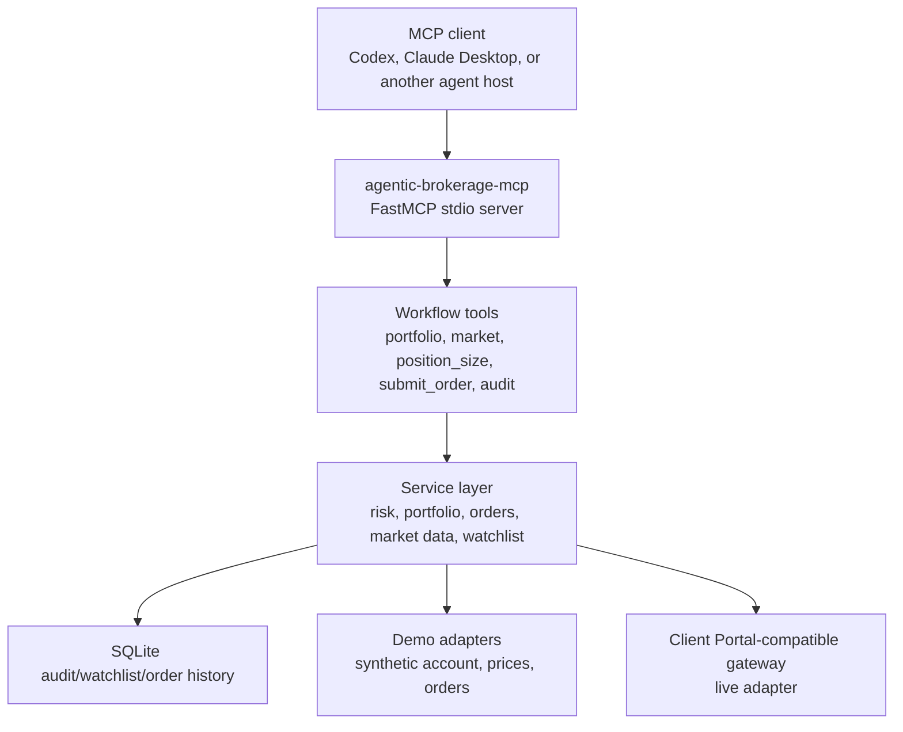

# Architecture

The server intentionally exposes a small workflow surface instead of a raw endpoint mirror. Agents get tools with stable, task-oriented contracts; broker-specific details stay inside adapters and services.

## Safety Boundary

`submit_order` defaults to `dry_run=true`. In `live` mode, any real submit, cancel, or modify operation also requires `AGENTIC_BROKERAGE_MCP_ENABLE_LIVE_TRADING=true`. Demo mode can simulate mutations without a broker connection.

Mutating actions write an audit record to SQLite. The audit log is part of the public API through the `audit` tool so an agent or operator can inspect recent actions and their parameters.
